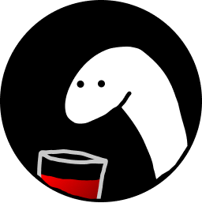
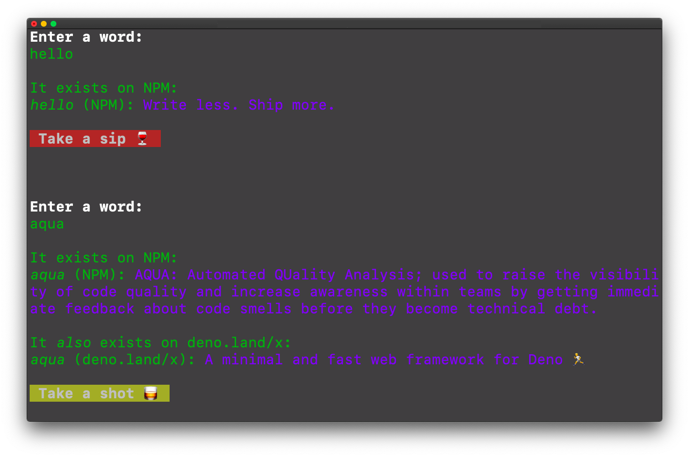

<h1 align="center">drink if exists</h1>
<p align="center"></p>
<p align="center">The NPM drinking game recreated and cli-ified with Deno with Deno</p>

<p align="center">
  <a href="https://deno.land/">
    
  </a>
  <a href="http://makeapullrequest.com/">
    
  </a>
  
</p>

<p align="center"></p>

To play the game, run the following command:
```
deno run --allow-net http://drink-if-exists.now.sh/mod.ts
```

## 🥴 How it works
The [NPMS API](https://npms.io/) was used to find NPM packages. To check if a Deno package exists, [database.json](https://github.com/denoland/deno_website2/blob/master/database.json) from [deno.land/x](https://deno.land/x/) (third party modules) is scraped.

## 🛠 Build setup
[Install Deno](https://deno.land/#installation), then clone or fork this repository. Run 

```
deno run --allow-net mod.ts
```

### Folder structure
The app is located in the `src/` folder, with the entry point being `mod.ts`.